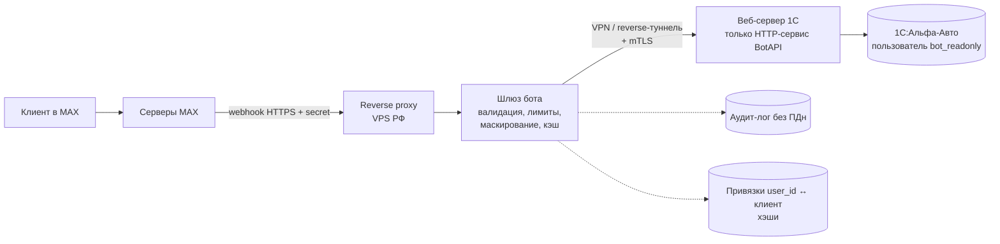

# 02. Безопасность интеграции бота MAX с 1С:Альфа-Авто

*Дата: 23.09.2026. Роль: архитектор ИБ. Статус: черновик для ТЗ и договора.*

Задача: клиент автосервиса пишет боту в мессенджере MAX номер заказ-наряда или телефон и получает список работ и статус выполнения. Данные берутся из 1С:Альфа-Авто. Главные требования заказчика: не допустить утечки данных клиентов и не подвергать риску 1С как критичную для бизнеса систему.

---

## Краткое резюме

1. **1С не выходит в интернет.** Ни веб-клиент, ни OData, ни HTTP-сервис 1С не публикуются наружу. Между мессенджером и 1С работает промежуточный **шлюз (backend бота)** на VPS в РФ. Шлюз обращается к 1С только по защищённому каналу: исходящий VPN/WireGuard-туннель из офиса или reverse-туннель. В 1С открыт один узкий HTTP-сервис **только для чтения**, с отдельным пользователем 1С и минимальными правами.
2. **Отвечать только по номеру заказа или только по телефону небезопасно.** Номера заказ-нарядов идут подряд и легко перебираются, а телефон клиента знают многие. Рекомендуемая схема для маленького автосервиса: **одноразовая привязка аккаунта MAX к клиенту** через код с акта приёмки (или через проверенную передачу контакта, если MAX это умеет). Резервный вход: «номер заказа + последние 4 цифры телефона» с жёстким лимитом попыток.
3. **Минимум данных в ответе:** статус, список работ без цен, ориентировочная дата готовности, госномер в маске (`А***АА 77`). Бот не выдаёт ФИО, VIN, суммы, историю и другие заказы.
4. **Защита от перебора:** лимиты по user_id и глобальные лимиты, одинаковый ответ на «не найдено» и «не ваш заказ», прогрессивные задержки, кэш и circuit breaker, чтобы нагрузка на бота не доходила до 1С.
5. **Секреты и логи:** токен бота и учётные данные 1С хранятся только в защищённом хранилище секретов шлюза. Персональные данные в логи не пишутся: только хэши и коды событий. Ключи ротируются по регламенту и сразу после любого инцидента.
6. **152-ФЗ:** автосервис является оператором ПДн. Если бот держит подрядчик, между ними заключается договор поручения обработки (ч. 3 ст. 6). Данные хранятся в РФ, с 01.07.2025 это требование распространяется и на обработчиков. С 01.09.2025 согласие оформляется отдельным документом. Нужны уведомление в РКН и регламент реагирования на утечки (сообщить в РКН за 24 часа, результаты расследования за 72 часа). Штрафы с 30.05.2025 выросли кратно.
7. **Стоимость минимального набора мер невысокая:** примерно 1–3 дня работы сверх функционала и VPS в РФ за 300–1000 ₽/мес. Желательный набор (мониторинг, WAF, аудит, пентест) добавляется по бюджету.

---

## 1. Модель угроз

### 1.1. Активы

| Актив | Критичность |
|---|---|
| База 1С:Альфа-Авто (ПДн клиентов, финансы, склад) | Критическая: остановка базы останавливает бизнес |
| Данные заказ-нарядов, которые отдаёт бот | Высокая: это ПДн |
| Токен бота MAX | Высокий: с ним можно выдать себя за бота и читать входящие |
| Учётные данные и ключи доступа шлюза к 1С | Критический: это прямой путь к данным |
| Таблица привязок user_id MAX ↔ контрагент | Высокая: это ПДн |
| Логи шлюза | Средняя, становится высокой, если в логи попали ПДн |
| Репутация автосервиса и доверие клиентов | Высокая |

### 1.2. Актёры

| Актёр | Мотив | Возможности |
|---|---|---|
| **A1. Любопытный или злонамеренный пользователь MAX** | Узнать чужой заказ (бывший супруг, конкурент, мошенник) | Пишет боту вручную, знает телефон или номер заказа жертвы |
| **A2. Автоматизированный атакующий (скрипт или бот-ферма)** | Массовый сбор базы клиентов (телефон + авто + ФИО) для продажи или мошенничества | Много аккаунтов MAX, прокси, скрипты перебора |
| **A3. Внешний атакующий по сети** | Проникнуть в 1С, шифровальщик, кража базы | Сканирует интернет в поисках опубликованных 1С и RDP |
| **A4. Мошенник под видом автосервиса** | Звонит клиенту «из сервиса» и выманивает оплату или коды | Использует утёкшие данные: номер заказа, авто, работы |
| **A5. Инсайдер у заказчика** | Сотрудник выгружает базу или меняет статусы | Легальный доступ к 1С |
| **A6. Инсайдер или компрометация у подрядчика** | Доступ к VPS, репозиторию, секретам | Администратор шлюза, утечка ноутбука или репозитория |
| **A7. Провайдер инфраструктуры или MITM** | Перехват трафика | Сеть между шлюзом и 1С, публичный Wi-Fi |
| **A8. DDoS / флуд** | Вывести сервис из строя, шантаж | Отправка множества сообщений и запросов |

### 1.3. Сценарии атак

| # | Сценарий | Актёр | Последствие |
|---|---|---|---|
| T1 | **Перебор номеров заказ-нарядов.** Номера последовательные (`ЗН-000123` → `ЗН-000124`), скрипт проходит весь диапазон | A1, A2 | Массовая утечка: чей автомобиль, какие работы, когда |
| T2 | **Подбор или использование известного телефона.** Телефон жертвы известен или перебирается по диапазону оператора | A1, A2, A4 | Узнают историю обслуживания и заказы жертвы |
| T3 | **Энумерация через различимые ответы.** «Заказ не найден» и «Это не ваш заказ» отвечают по-разному, по разнице определяется существование заказа | A2 | Подтверждение, что номер или телефон есть в базе, облегчает T1 и T2 |
| T4 | **Компрометация токена бота** (утёк из репозитория, лога, переписки) | A6, A3 | Злоумышленник меняет webhook и получает все сообщения клиентов, отвечает от имени сервиса (фишинг) |
| T5 | **Компрометация шлюза** (уязвимость, слабый SSH-пароль, устаревшая ОС) | A3, A6 | Доступ к кэшу, логам, привязкам и ключам к 1С; попытка развить атаку на 1С через туннель |
| T6 | **Прямой доступ в 1С через опубликованный сервис** (веб-клиент или OData наружу, открытый порт 1540/1541/80/443/3389) | A3 | Подбор паролей 1С, выгрузка всей базы через OData, шифровальщик. Самый тяжёлый сценарий |
| T7 | **Инсайдер** выгружает данные через бота, например массово по чужим телефонам | A5, A6 | Утечка, в которой трудно найти виновного без аудита |
| T8 | **Утечка через логи**: в логах шлюза, в трекере ошибок (Sentry и т. п.) или в логах 1С лежат телефоны, ФИО, тексты сообщений | A6, A3 | Утечка ПДн без взлома основной системы |
| T9 | **MITM** на канале шлюз ↔ 1С или шлюз ↔ MAX | A7 | Перехват ПДн и учётных данных 1С |
| T10 | **DDoS / флуд на бота**, из-за которого перегружается 1С: каждый запрос бота порождает запрос в 1С, 1С тормозит у менеджеров, заканчиваются лицензии и сеансы | A8, A2 | Отказ в обслуживании критичной системы |
| T11 | **Инъекции через текст сообщений**: номер заказа передаётся в строку запроса 1С (конкатенация в `Запрос.Текст`), в URL или путь OData, в шаблон ответа (разметка, ссылки) | A1, A2 | Выборка чужих данных, ошибки 1С, фишинговые ссылки в ответах |
| T12 | **Социальная инженерия через бота.** Злоумышленник знает, что клиент ждёт машину, и пишет ему от «сервиса» с другого аккаунта | A4 | Мошенничество с «доплатой» |
| T13 | **Подмена webhook-запросов**: на endpoint шлюза отправляются поддельные «обновления от MAX» | A2 | Обход идентификации (подделка user_id или контакта) |
| T14 | **Потеря или кража телефона клиента** с открытым MAX | — | Посторонний видит статус заказа: низкий риск при минимизации данных |

---

## 2. Архитектура

### 2.1. Принцип «1С не смотрит в интернет»

Обоснование:
- Опубликованные наружу базы 1С находят сканерами (Shodan и аналоги). По ним регулярно идут подбор паролей и атаки шифровальщиков. Основные векторы атак на малый бизнес: открытый RDP и веб-публикация 1С.
- Стандартный интерфейс OData публикует **все объекты**, на которые у пользователя есть права. Одна ошибка в правах, и доступна вся база: контрагенты, суммы, телефоны.
- 1С не рассчитана на прямую нагрузку из интернета. Флуд бьёт по рабочим местам менеджеров.
- Обновления платформы и конфигурации устанавливают по графику бухгалтерии, а не по графику безопасности. Уязвимое окно у публичного сервиса получается длинным.

Отсюда правило: **к 1С обращается только шлюз, и только через закрытый канал. Мессенджер и пользователи с 1С не соединяются никогда.**

### 2.2. Схема

```
   Клиент (MAX app)                                   Серверы MAX (VK)
        │   сообщение: "статус", номер/код                   │
        └──────────────────────────────────────────────────▶ │
                                                             │ webhook (HTTPS) / long polling
                                                             ▼
┌──────────────────────── VPS в РФ (DMZ, подрядчик или заказчик) ────────────────────────┐
│  Reverse proxy (nginx/caddy), TLS 1.2+, allowlist IP MAX (если известны), проверка    │
│  секрета webhook, rate limit L7                                                        │
│        │                                                                               │
│        ▼                                                                               │
│  Шлюз бота (bot-gateway)                                                               │
│   - валидация ввода (regex: номер заказа, 4 цифры, код)                                │
│   - идентификация и привязка user_id ↔ контрагент (hash)                               │
│   - rate limiting (Redis/SQLite), блокировки                                           │
│   - минимизация и маскирование ответа                                                  │
│   - кэш статусов (TTL 1–5 мин), circuit breaker к 1С                                   │
│   - аудит-лог без ПДн                                                                  │
│   - секреты: env из хранилища / sops / systemd credentials                             │
│        │                                                                               │
│        │ только исходящие к 1С через туннель; firewall: входящие 443 (и SSH по ключу    │
│        │ с allowlist IP администратора)                                                │
└────────┼───────────────────────────────────────────────────────────────────────────────┘
         │  WireGuard / IPsec VPN (или SSH/WireGuard reverse-туннель, инициируемый из офиса)
         │  внутри: HTTPS + mTLS или Basic-auth по TLS, allowlist IP туннеля
         ▼
┌──────────────────────── Сеть автосервиса (или хостинг 1С) ─────────────────────────────┐
│  Firewall/роутер: наружу ничего не опубликовано; из туннеля доступен ТОЛЬКО            │
│  host:port веб-публикации HTTP-сервиса                                                 │
│        │                                                                               │
│        ▼                                                                               │
│  Веб-сервер (Apache/IIS) — публикация ТОЛЬКО HTTP-сервиса BotAPI                        │
│  (без веб-клиента, без OData, без web-сервисов SOAP)                                   │
│        │                                                                               │
│        ▼                                                                               │
│  1С:Альфа-Авто + расширение "BotAPI"                                                   │
│   - GET /status?order=...&phone4=...     (read-only)                                   │
│   - GET /orders-by-client?client_ref=... (read-only)                                   │
│   - пользователь "bot_readonly": роль только на чтение нужных объектов                 │
└────────────────────────────────────────────────────────────────────────────────────────┘
```

Вариант на mermaid:



### 2.3. Ключевые решения

| Решение | Требование |
|---|---|
| **Размещение шлюза** | VPS у российского провайдера с дата-центром в РФ (Selectel, Timeweb Cloud, Yandex Cloud, VK Cloud, REG.RU и т. п.). Зарубежные хостинги и SaaS для хранения ПДн **запрещены** (ч. 5 ст. 18 152-ФЗ в ред. 23-ФЗ). Это касается и зарубежных трекеров ошибок и логов. |
| **Канал к 1С** | Вариант А (предпочтительный): WireGuard-туннель **из офиса наружу** к VPS. В офисе не нужно открывать входящие порты, и статический IP не обязателен. Вариант Б: site-to-site IPsec на роутере (MikroTik и т. п.). Вариант В: если 1С у хостера, то VPN до хостера с allowlist по IP шлюза. |
| **Внутри туннеля** | HTTPS до веб-публикации (самоподписанный CA заказчика), при возможности mTLS (клиентский сертификат шлюза проверяет Apache/nginx перед 1С). Минимум Basic-auth пользователя `bot_readonly` поверх TLS. |
| **Firewall офиса** | Из туннеля доступен только `IP_веб-сервера:порт_HTTP-сервиса`. К серверу 1С (1540/1541/1560-1591), RDP, SMB, другим ПК доступа нет. |
| **Публикация 1С** | Отдельная публикация (отдельный vrd/каталог) **только с HTTP-сервисом** расширения. Флажки «Публиковать тонкий и веб-клиент», «Публиковать стандартный интерфейс OData» и web-сервисы выключены. |
| **HTTP-сервис вместо OData** | Узкий контракт: 2–3 метода, фиксированные параметры, фиксированный набор полей в ответе. Логика маскирования и проверки «телефон совпадает с заказом» выполняется **внутри 1С**. Тогда даже скомпрометированный шлюз не выгрузит больше, чем даёт метод. |
| **Реализация в 1С** | Через **расширение конфигурации**, чтобы не снимать типовую Альфа-Авто с поддержки и не мешать обновлениям. Запросы только параметризованные (`Запрос.УстановитьПараметр`), без конкатенации текста запроса. |
| **Пользователь 1С** | `bot_readonly`: отдельная роль расширения. Права «Чтение» только на нужные объекты (Заказ-наряд, справочник автомобилей для госномера, статусы), право на HTTP-сервис. Без интерактивного входа, без «Администрирования», без права на внешние обработки. Запрет входа в тонкий/толстый клиент. |
| **Read-only** | Методы только GET. В модулях расширения нет записи объектов. Проверяется на ревью кода. |
| **Защита 1С от нагрузки** | Кэш на шлюзе, circuit breaker (при ошибках или таймаутах 1С шлюз перестаёт обращаться к ней на N минут), ограничение параллельных запросов к 1С (например, не больше 2), таймаут 5–10 с. На веб-сервере ограничение пула сеансов для публикации. |
| **Ответная связь от 1С (опционально)** | Если понадобятся push-уведомления «машина готова», 1С **не ходит в интернет сама**. Шлюз опрашивает 1С по расписанию через тот же туннель (pull), либо 1С отправляет событие только на внутренний IP шлюза в туннеле. |

---

## 3. Идентификация клиента

### 3.1. Проблема

- Номер заказ-наряда обычно последовательный и короткий. Перебрать 10 000 номеров скриптом можно за минуты.
- Телефон знают родственники, бывшие, коллеги, мошенники с утёкшими базами. Мобильные номера к тому же перебираются по диапазонам.
- Ни номер заказа, ни телефон не являются **секретом**. Это идентификаторы, а для доступа нужен ещё фактор владения или знания.

### 3.2. Варианты

| # | Схема | Безопасность | Удобство | Стоимость | Комментарий |
|---|---|---|---|---|---|
| V1 | Только номер заказа | Очень низкая | Отличное | — | **Недопустимо**: тривиальный перебор (T1) |
| V2 | Только телефон | Очень низкая | Отличное | — | **Недопустимо**: телефон не секрет (T2) |
| V3 | Номер заказа + последние 4 цифры телефона | Средняя: 10⁴ вариантов на заказ; с лимитом 5 попыток на заказ и на user_id перебор нереален, но знакомый клиента знает телефон целиком | Хорошее | Низкая | Хороший **базовый/резервный** вариант при жёстких лимитах |
| V4 | OTP по SMS на телефон из карточки клиента | Высокая: владение SIM | Среднее: надо ждать SMS | Средняя: SMS-шлюз ~3–6 ₽/SMS, договор, защита от SMS-pumping | Добавляет ещё одного обработчика ПДн (SMS-провайдер в РФ) |
| V5 | Передача контакта в MAX (кнопка «Поделиться номером»), телефон берётся из аккаунта | Высокая, **если** MAX гарантирует, что контакт принадлежит самому пользователю (номер верифицирован при регистрации и его нельзя подделать) | Отличное: одна кнопка | Низкая | **Допущение, требует проверки по MAX** (см. раздел «Что нужно проверить по MAX») |
| V6 | Одноразовая привязка user_id MAX ↔ контрагент в 1С (после V3/V4/V5/V7). Дальше клиент просто пишет «статус» | Высокая: user_id не подделать через обычный клиент | Отличное после первой привязки | Низкая–средняя | Хранить привязку на шлюзе (хэш ссылки контрагента) или в регистре сведений 1С. Отвязка по запросу и по сроку |
| V7 | Одноразовый код на акте приёма-передачи (или QR / deep-link) | Высокая: код знает только тот, кто держит акт; случайный код 6–8 символов, срок жизни ограничен | Отличное: «отсканируйте QR на акте» | Низкая–средняя: доработка печатной формы в 1С | Лучшее соотношение для автосервиса: код вручается лично при приёмке |

### 3.3. Рекомендация для маленького автосервиса

**Основной сценарий: V7 + V6.**
1. При приёмке автомобиля 1С генерирует для заказ-наряда случайный код (не выводимый из номера), например `K7P-4QX` или 6 цифр. Код печатается на акте приёма или заказ-наряде вместе с QR-кодом ссылки на бота. Если MAX поддерживает deep-link с параметром (допущение), код передаётся через параметр.
2. Клиент сканирует QR или вводит код в бот. Шлюз проверяет код через 1С и привязывает user_id MAX к заказу. Контрагент привязывается, только если клиент явно согласился («Показывать все ваши будущие заказы в этом чате? Да/Нет»).
3. Дальше клиент пишет «статус» и получает текущие заказы по привязке, без ввода данных.
4. Код одноразовый для привязки, действует до закрытия заказа плюс N дней. Если сотрудник по ошибке отдал акт не тому человеку, привязку можно сбросить в 1С.

**Резервный сценарий** (акт потерян, клиент записан по телефону): **V3** «номер заказа + последние 4 цифры телефона» с лимитами из раздела 5. Если MAX подтвердит достоверную передачу контакта, вместо V3 используется **V5 + V6**: кнопка «Поделиться номером», шлюз сверяет номер с телефоном контрагента в 1С.

**SMS-OTP (V4)** стоит включать только при появлении реальных злоупотреблений или по требованию клиента: это расходы, ещё один обработчик ПДн и риск SMS-pumping.

**Сценарий «только по телефону» из запроса клиента** реализуется как V5 (если MAX позволяет) или V4. Простой ввод телефона текстом **не должен** давать доступ к данным.

---

## 4. Минимизация данных

### 4.1. Что возвращать

| Поле | Формат |
|---|---|
| Номер заказ-наряда | Как есть (клиент его знает) |
| Автомобиль | Марка/модель + **маскированный** госномер: `Kia Rio, А***ВС 777` |
| Статус заказа | Человекочитаемый: «Принят», «В работе», «Ожидает запчасти», «Готов к выдаче», «Выдан». Словарь соответствия статусов Альфа-Авто определяет исследователь 1С |
| Список работ | Наименование работы + статус (выполнена / в работе / не начата). **Без цен, нормочасов, исполнителей** |
| Ориентировочная дата готовности | Если заполнена в документе |
| Контакт сервиса | Телефон администратора (статический текст) |

### 4.2. Что не возвращать

- ФИО (максимум имя для обращения: «Иван, ваш заказ…», и только после привязки).
- Полный телефон, e-mail, адрес.
- VIN, номер кузова, СТС/ПТС, полный госномер.
- Суммы, цены, скидки, оплаты, долги. Их можно добавить позже как опцию **только** после сильной идентификации (V4/V5/V7) и по отдельному решению заказчика.
- Пробег, история обслуживания, другие заказы, если нет привязки к контрагенту.
- ФИО мастеров, внутренние комментарии («клиент скандальный»), материалы со складскими ценами.

### 4.3. Где делать минимизацию

Минимизация делается **в HTTP-сервисе 1С**: сервис не отдаёт лишних полей вообще. Шлюз маскирует повторно (defense in depth). Контракт ответа (JSON-схема) фиксируется в ТЗ, и любое новое поле проходит через согласование с заказчиком.

### 4.4. Хранение на шлюзе

- Кэш ответов только в памяти или Redis с TTL ≤ 5 мин, без записи на диск.
- Таблица привязок: `hash(user_id MAX)` → `ссылка контрагента/заказа (GUID)`. GUID без ФИО и телефона. Срок хранения задан: например, 12 месяцев с последнего обращения или до отзыва согласия.
- Переписку не хранить. Тексты сообщений в БД не писать.

---

## 5. Защита от перебора

| Мера | Параметры (стартовые, уточняются) |
|---|---|
| Строгая валидация ввода | Номер заказа по regex формата Альфа-Авто, 4 цифры, код по алфавиту без похожих символов. Всё остальное отбрасывается без запроса к 1С |
| Лимит неудачных попыток на user_id | 5 неудач за 15 мин → пауза 15 мин; 10 за сутки → блокировка на 24 ч + событие в аудит |
| Лимит на **целевой объект** (номер заказа / телефон) | 5 неудачных проверок на один заказ за сутки от **любых** пользователей → заказ временно закрыт для V3 (защита от распределённого перебора с многих аккаунтов) |
| Глобальный лимит | Не больше N (например, 60) обращений в 1С в минуту всего. При превышении ответ «сервис временно недоступен» |
| Лимит по IP | На reverse proxy для входящих webhook (защита endpoint). Пользовательский IP в мессенджер-боте недоступен, поэтому основной ключ лимита — user_id |
| Прогрессивные задержки | 1-я ошибка без задержки, далее 2 с, 5 с, 15 с перед ответом |
| Одинаковые ответы | «Не найдено», «телефон не совпал», «заказ закрыт» и «заблокировано» дают **один и тот же** текст: «Не удалось найти заказ по этим данным. Проверьте данные или позвоните нам: …». Время ответа выравнивается (фиксированная минимальная задержка) |
| Отсутствие подтверждения существования | Бот нигде не говорит «такой заказ есть, но данные не совпали» и «этот телефон есть в базе» |
| Коды V7 | Случайные, ≥ 6 символов из 30-символьного алфавита (~7·10⁸) или 6 цифр при жёстких лимитах; одноразовые; сравнение за постоянное время |
| Детектирование аномалий | Алерт администратору, если за час больше X неудач или больше Y разных номеров заказов от одного user_id |
| Ручная блокировка | Черный список user_id в конфиге шлюза |

---

## 6. Секреты и логи

### 6.1. Секреты

| Секрет | Где хранить | Ротация |
|---|---|---|
| Токен бота MAX | Переменная окружения из файла с правами `600` (systemd `LoadCredential` / docker secrets / sops-age). **Не** в репозитории, **не** в чатах, **не** в скриншотах | При смене подрядчика или сотрудника, при подозрении на утечку, плановая ротация раз в 12 мес. (если MAX позволяет перевыпуск — проверить) |
| Секрет webhook (если MAX поддерживает) | Там же | Вместе с токеном |
| Логин/пароль `bot_readonly` в 1С | Там же. Пароль длинный, случайный (≥ 24 символа) | Раз в 6–12 мес. и при инциденте |
| Клиентский сертификат mTLS | Ключ на шлюзе, CA у заказчика | Срок 1 год |
| Ключи WireGuard | На шлюзе и роутере офиса | При инциденте; ключ отзывается удалением peer |
| SSH-доступ к VPS | Только ключи, вход по паролю отключён, root-вход отключён | При смене администратора |
| Мастер-доступы (панель хостинга, регистратор, аккаунт владельца бота в MAX) | Оформлены **на заказчика**, 2FA, передаются подрядчику как делегированный доступ | Отзыв при окончании договора |

Правило: **все учётные записи (VPS, бот, домен) принадлежат заказчику.** Подрядчик работает по делегированию. После окончания договора доступ отзывается без пересоздания бота.

### 6.2. Логи

- **Запрещено логировать:** тексты сообщений, телефоны, ФИО, госномера, коды подтверждения, токены, тела ответов 1С.
- **Разрешено:** время, `hash(user_id)` (HMAC с секретной солью), тип события (`lookup_ok`, `lookup_fail`, `rate_limited`, `bound`, `unbound`, `1c_timeout`), номер заказа **в хэше или маске**, длительность, код ответа 1С.
- Уровень логирования в продакшене `INFO`. Отладочный режим с телами запросов запрещён. Если отладка всё же нужна, она включается временно, пишет на стенд с обезличенными данными, и логи удаляются.
- Трекеры ошибок и хранилища логов допускаются только российские или self-hosted. Перед отправкой исключения очищаются от ПДн (scrubbing).
- Срок хранения: технические логи 30 дней, аудит-лог 6–12 мес.
- **Аудит:** кто (hash user_id) → какой заказ (маска) → результат. Этого достаточно, чтобы расследовать T7 и подготовить ответ в РКН при инциденте.
- На стороне 1С в журнале регистрации видны сеансы пользователя `bot_readonly`, это второй источник аудита.

---

## 7. Правовой контур РФ (практический чек-лист)

> Не юридическая консультация. Для финальной редакции документов рекомендуется юрист или готовый шаблонный пакет.

### 7.1. Роли

- **Автосервис** (ООО/ИП) является **оператором ПДн**: определяет цели обработки, данные его клиентов.
- **Исполнитель бота**, если он хостит шлюз и имеет доступ к данным, является **лицом, обрабатывающим ПДн по поручению оператора** (ч. 3 ст. 6 152-ФЗ).
- **MAX (VK)** является отдельным оператором данных пользователя мессенджера. Автосервис передаёт ответ через его инфраструктуру. Это нужно отразить в политике ПДн: «ответы передаются через мессенджер MAX».

### 7.2. Чек-лист для автосервиса (оператора)

- [ ] Подано **уведомление в Роскомнадзор** об обработке ПДн (форма по приказу РКН № 180 от 28.10.2022, через личный кабинет на pd.rkn.gov.ru). Если уведомление подано раньше, нужно проверить, что в нём указаны цели, категории данных и информационные системы, и при необходимости подать изменения (добавить «информирование клиентов о ходе ремонта через мессенджер»).
- [ ] Есть **политика обработки ПДн**, опубликована (на сайте или ссылкой в боте).
- [ ] **Согласие на обработку ПДн** для информирования через мессенджер **отдельным документом** (требование с 01.09.2025): отдельный бланк при приёмке или отдельное согласие в боте (кнопка «Согласен» + ссылка на текст). Согласия, собранные до 01.09.2025, остаются действительными. Сама выдача статуса ремонта клиенту, скорее всего, укладывается в «исполнение договора» (п. 5 ч. 1 ст. 6), но для привязки аккаунта мессенджера и уведомлений надёжнее получить согласие.
- [ ] **Договор поручения** с исполнителем бота (если исполнитель имеет доступ к ПДн). Обязательные элементы по ч. 3 ст. 6: перечень ПДн, цели, перечень действий, обязанность соблюдать конфиденциальность, меры защиты по ст. 19, обязанность уведомлять оператора об инцидентах, требование локализации в РФ.
- [ ] **Локализация:** БД шлюза, логи, бэкапы, кэш находятся на серверах в РФ. С 01.07.2025 (23-ФЗ) требование прямо распространяется и на обработчиков, а первичный сбор через иностранные БД запрещён.
- [ ] Назначен **ответственный за организацию обработки ПДн** (ст. 22.1). В малом бизнесе это может быть директор.
- [ ] Определён **уровень защищённости ПДн** (ПП РФ № 1119). Для клиентской базы малого автосервиса (иные категории, меньше 100 тыс. субъектов, угрозы 3-го типа) это обычно **УЗ-4**. Меры по приказу ФСТЭК № 21 в минимальном объёме: разграничение доступа, антивирус, резервирование, учёт носителей.
- [ ] **Регламент реагирования на инцидент (утечку)**: уведомление в РКН **в течение 24 часов** с момента выявления и результаты внутреннего расследования **в течение 72 часов** (ч. 3.1 ст. 21). Сюда же взаимодействие с ГосСОПКА через РКН.
- [ ] Порядок ответа на запросы субъектов (доступ, отзыв согласия, удаление привязки): в боте предусмотрена команда «Отвязать мой аккаунт / удалить мои данные».
- [ ] Ответственность знают все: с 30.05.2025 (420-ФЗ) штрафы за неуведомление РКН об утечке составляют для организаций 1–3 млн ₽; за утечку есть оборотные штрафы при повторности; за нарушение локализации до 6 млн ₽ (18 млн ₽ повторно).

### 7.3. Если исполнитель — ИП или самозанятый

| Вопрос | ИП | Самозанятый (НПД, без ИП) |
|---|---|---|
| Может ли быть обработчиком по поручению | Да | Юридически да (поручение может получить физлицо), но у заказчика меньше гарантий: нет печати, обычно нет процессов ИБ, сложнее взыскание |
| Нужно ли уведомление в РКН самому исполнителю | Как обработчику по поручению — как правило, нет (уведомляет оператор). Если исполнитель собирает ПДн для своих целей, нужно | То же |
| Ответственность | Административная как ИП (штрафы для ИП приравнены к юрлицам по ряду составов) | Как физлицо, ниже, но есть и уголовная (ст. 272.1 УК РФ за незаконное использование ПДн) |
| Рекомендация | Допустимо, с договором поручения и NDA | **Лучше, чтобы инфраструктура (VPS, бот, домен) принадлежала автосервису**, а самозанятый выполнял разработку и сопровождение по делегированному доступу. Договор поручения и NDA всё равно нужны, так как у исполнителя есть доступ к серверу |

Практический вывод: **VPS, аккаунт бота и учётные записи регистрирует автосервис на себя**. Тогда исполнитель, независимо от статуса, работает как администратор чужой системы по договору с условиями конфиденциальности и поручения. Это упрощает смену подрядчика и снижает риски для заказчика.

---

## 8. Эксплуатация

| Тема | Требования |
|---|---|
| **Обновления** | ОС VPS: автоустановка security-обновлений (unattended-upgrades). Зависимости шлюза: ежемесячная проверка (`npm audit` / `pip-audit` / Dependabot в приватном репозитории). Платформа 1С и веб-сервер обновляются заказчиком или его франчайзи. Расширение BotAPI проверяется после **каждого** обновления Альфа-Авто (регрессионный тест 3–5 запросов). |
| **Мониторинг** | Healthcheck шлюза (внешний uptime-монитор), проверка связи с 1С каждые 5 мин, алерты в Telegram/MAX/почту администратору: 1С недоступна, всплеск ошибок, срабатывание лимитов перебора, заканчивается срок сертификатов, мало места на диске. |
| **Недоступность 1С** | Circuit breaker. Бот отвечает: «Информация временно недоступна, попробуйте позже или позвоните: …». **Не** показывает устаревший кэш старше TTL без пометки. Запросы в очередь не копятся, 1С после восстановления «волной» не нагружается. Плановые окна (обновление 1С, закрытие месяца) можно задать расписанием. |
| **Недоступность шлюза** | Бот молчит или отвечает серверами MAX с задержкой. На бизнес не влияет: 1С работает независимо. Это главное преимущество архитектуры. |
| **Бэкапы шлюза** | Нужны, но немного: конфигурация (IaC/скрипты, в git без секретов), таблица привязок (ежедневно, **шифрованный** бэкап, хранилище в РФ, срок 14–30 дней), секреты хранятся отдельно у заказчика (менеджер паролей). Кэш и логи не бэкапятся. Время восстановления шлюза с нуля ≤ 4 часа. |
| **Бэкапы 1С** | Вне периметра проекта, но стоит спросить заказчика, есть ли они: подключение бота не должно стать поводом узнать, что бэкапов 1С нет. |
| **Инцидент** | План: 1) изолировать (остановить шлюз, разорвать туннель, отозвать ключи WireGuard, сменить пароль `bot_readonly`); 2) перевыпустить токен бота; 3) снять копию логов и диска для анализа; 4) оценить объём затронутых ПДн по аудит-логу; 5) уведомить заказчика (исполнитель: немедленно, не позже X часов по договору); 6) заказчик уведомляет РКН за 24 ч / 72 ч; 7) восстановить с чистого образа; 8) разбор и отчёт. |
| **Отключение «рубильником»** | Заказчик может сам отключить бота одной кнопкой: остановить туннель на роутере или выключить публикацию HTTP-сервиса. Инструкция на 1 страницу. |
| **Смена подрядчика / окончание договора** | Передача репозитория, документации, отзыв доступов, смена всех секретов. |

---

## 9. Требования безопасности для договора и ТЗ

Формулировки, которые можно вставить почти без изменений. Для клиента они показывают, за что он платит: **«ваша 1С остаётся закрытой, чужой человек не узнает ничего о ваших клиентах, при инциденте вы знаете, что делать»**.

### 9.1. В ТЗ

1. **Архитектура.** База 1С не публикуется в интернет. Взаимодействие с 1С идёт только через шлюз по зашифрованному VPN-каналу. На стороне 1С публикуется только специализированный HTTP-сервис; веб-клиент, OData и SOAP-сервисы не публикуются.
2. **Только чтение.** HTTP-сервис не изменяет данные 1С. Доработки 1С выполняются расширением без снятия типовой конфигурации с поддержки.
3. **Учётная запись 1С** с минимальными правами (перечень объектов приложен), без интерактивного входа.
4. **Идентификация клиента:** схема из раздела 3 (коды на акте + привязка; резерв «номер + 4 цифры»). Выдача данных только по номеру заказа или только по телефону, введённому текстом, **запрещена**.
5. **Состав выдаваемых данных:** закрытый перечень полей из раздела 4. Изменение перечня только по письменному согласованию.
6. **Защита от перебора:** лимиты из раздела 5, одинаковые ответы, алерты.
7. **Защита 1С от нагрузки:** кэш, ограничение параллельности и частоты запросов к 1С, circuit breaker.
8. **Размещение:** все компоненты, хранящие или обрабатывающие ПДн, находятся в ЦОД на территории РФ.
9. **Секреты:** не хранятся в коде и репозитории; регламент ротации.
10. **Логи:** без ПДн, сроки хранения, аудит обращений.
11. **Приёмка по безопасности:** чек-лист (нет открытых портов 1С снаружи — проверка внешним сканированием; перебор блокируется; ответы одинаковые; логи не содержат ПДн; пользователь 1С не может войти интерактивно; OData не опубликован).
12. **Документация:** схема, инструкция «рубильника», регламент инцидента, инструкция по ротации секретов.

### 9.2. В договоре

- Договор (или раздел) **поручения обработки ПДн** по ч. 3 ст. 6 152-ФЗ: перечень ПДн, цели, действия, меры защиты по ст. 19, локализация в РФ, запрет передачи третьим лицам и субподрядчикам без согласия, возврат/уничтожение данных по окончании.
- **Конфиденциальность (NDA)** на ПДн и сведения об ИТ-инфраструктуре заказчика.
- **Уведомление об инциденте**: исполнитель сообщает заказчику не позже **12 часов** с момента выявления (чтобы заказчик успел уложиться в 24 часа перед РКН) и участвует в расследовании.
- **Принадлежность активов:** VPS, аккаунт бота, домен, репозиторий принадлежат заказчику. Исполнитель передаёт исходный код и доступы.
- **Сопровождение (если есть абонентка):** SLA реакции на инцидент, ежемесячные обновления, мониторинг, ротация секретов.
- **Разграничение ответственности:** исполнитель отвечает за шлюз и расширение; заказчик — за 1С, сеть офиса, бэкапы 1С, юридические документы (политика, согласия, уведомление РКН). Дополнительно исполнитель может помочь с шаблонами за отдельную плату.
- **Право заказчика на аудит**: запрос логов доступа, отчёт о мерах защиты.

---

## Таблица «Угроза → мера → стоимость»

| Угроза | Мера | Стоимость |
|---|---|---|
| T1 Перебор номеров заказов | Нет доступа по одному номеру; коды на акте; «номер + 4 цифры»; лимиты по user_id и по объекту | Низкая |
| T2 Известный телефон | Телефон текстом не даёт доступа; V5 (контакт MAX) или V4 (SMS-OTP) | Низкая (V5) / Средняя (V4) |
| T3 Энумерация по ответам | Одинаковые тексты и время ответа | Низкая |
| T4 Кража токена бота | Секреты вне кода, права 600, ротация, аккаунт у заказчика, проверка секрета webhook | Низкая |
| T5 Компрометация шлюза | Hardening VPS (SSH-ключи, firewall, автообновления), минимум данных на шлюзе, узкий API 1С, mTLS | Низкая–средняя |
| T6 Прямой доступ в 1С | 1С не публикуется; VPN; публикация только HTTP-сервиса; firewall офиса; внешнее сканирование при приёмке | Средняя (настройка VPN/роутера) |
| T7 Инсайдер | Аудит-лог, журнал регистрации 1С, лимиты действуют и на «своих», NDA, минимум полей | Низкая |
| T8 Утечка через логи | Логи без ПДн, scrubbing, российские/self-hosted сервисы, сроки хранения | Низкая |
| T9 MITM | TLS до MAX, VPN + TLS/mTLS до 1С | Низкая–средняя |
| T10 DDoS → отказ 1С | Кэш, глобальный лимит, ограничение параллельности, circuit breaker, пул сеансов веб-публикации; при необходимости DDoS-защита хостера | Низкая (базовая) / Средняя (DDoS-защита) |
| T11 Инъекции | Regex-валидация, параметризованные запросы 1С, экранирование разметки в ответах, в ответах нет ссылок из данных | Низкая |
| T12 Мошенники от имени сервиса | Бот никогда не просит оплату и коды; предупреждение в приветствии; минимум данных | Низкая |
| T13 Поддельные webhook | Секрет webhook / подпись MAX (проверить), allowlist IP MAX (если опубликованы), неугадываемый путь | Низкая |
| T14 Чужой в руках телефон | Минимизация данных, команда «отвязать», срок жизни привязки | Низкая |
| Юридические риски | Уведомление РКН, отдельное согласие, договор поручения, локализация, регламент инцидента | Низкая–средняя (шаблоны / юрист) |

---

## Минимально необходимый набор мер

Без этих мер запуск не рекомендуется.

1. 1С не опубликована в интернет. Шлюз на VPS в РФ, связь через VPN/туннель.
2. Отдельная публикация только HTTP-сервиса из расширения (без OData и веб-клиента), методы только на чтение.
3. Пользователь `bot_readonly` с минимальными правами, без интерактивного входа, со сложным паролем.
4. Идентификация: код на акте + привязка user_id; резерв «номер заказа + 4 последние цифры телефона». Ни номер, ни телефон по отдельности данных не открывают.
5. Закрытый перечень полей ответа, маскирование госномера, без ФИО, VIN, сумм.
6. Лимиты попыток по user_id и по заказу, одинаковые ответы, глобальный лимит к 1С, кэш, circuit breaker, таймауты.
7. Строгая валидация ввода и параметризованные запросы в 1С.
8. Секреты вне кода, SSH только по ключам, firewall, автообновления безопасности на VPS.
9. Логи без ПДн, аудит-лог обращений.
10. Все аккаунты (VPS, бот, домен) принадлежат заказчику.
11. Юридический минимум: уведомление РКН (или его актуализация), политика ПДн, отдельное согласие, договор поручения + NDA с исполнителем, регламент инцидента (24/72 ч).
12. Приёмочные проверки безопасности (раздел 9.1, п. 11) и инструкция «рубильника».

## Желательный набор мер

1. mTLS между шлюзом и веб-публикацией 1С.
2. Подтверждение через контакт MAX (V5), если MAX это достоверно поддерживает, или SMS-OTP (V4) для высокорисковых сценариев (например, если позже решат показывать суммы).
3. Внешний мониторинг и алерты (uptime, аномалии перебора, срок сертификатов).
4. Централизованный аудит с отчётом заказчику раз в месяц (обращения, блокировки, инциденты).
5. Шифрованные бэкапы таблицы привязок и IaC-скрипты развёртывания (восстановление ≤ 4 ч).
6. Scrubbing ПДн в трекере ошибок (self-hosted GlitchTip/Sentry в РФ).
7. DDoS-защита хостера или прокси (российский провайдер).
8. Разовый внешний пентест / сканирование периметра офиса и VPS.
9. Автоматические тесты безопасности: перебор, одинаковость ответов, отсутствие лишних полей в JSON.
10. Команда в боте «Удалить мои данные / отвязать аккаунт» и автоматическое удаление привязок по сроку.
11. Регламент ежегодной ротации всех секретов и ревизии прав пользователя 1С.

---

## Вопросы клиенту

1. Есть ли у вас **политика обработки ПДн** и **уведомление в Роскомнадзор**? Кто его подавал и когда?
2. Как сейчас оформляется **согласие клиента** на обработку ПДн при приёмке автомобиля? Есть ли отдельный бланк (требование с 01.09.2025)?
3. Кто у вас **отвечает за ИБ и за 1С**: штатный сотрудник, франчайзи 1С, приходящий админ?
4. **Где работает 1С**: на сервере в офисе, на компьютере директора, у хостера (облако 1С, 1cfresh, аренда сервера)? Файловая или клиент-серверная база?
5. Опубликована ли 1С сейчас в интернет (веб-клиент, RDP для удалённой работы)? Как сотрудники подключаются удалённо?
6. Есть ли **VPN** в офис? Какой роутер (MikroTik, Keenetic, провайдерский)? Кто им управляет?
7. Есть ли **статический белый IP** у офиса? (При схеме «туннель из офиса наружу» он не обязателен.)
8. Есть ли **резервные копии 1С**, где они лежат, проверялось ли восстановление?
9. Кто будет **владельцем** VPS и аккаунта бота: автосервис (рекомендуем) или исполнитель?
10. Какие данные вы **готовы** показывать клиенту в боте? Нужны ли суммы? (Рекомендуем без сумм на первом этапе.)
11. Готовы ли вы печатать на акте приёмки **QR-код / код для бота** и объяснять его клиенту при приёмке?
12. Сколько примерно заказ-нарядов в месяц и сколько клиентов в базе? (Нужно для лимитов и оценки уровня защищённости.)
13. Кто у вас контактное лицо при инциденте (ночью и в выходные)?
14. Есть ли у вас сайт, где можно разместить политику ПДн и текст согласия?

---

## Что нужно проверить по MAX

Допущения о мессенджере, от которых зависит выбор схемы. Проверить в документации MAX Bot API (dev.max.ru) отдельно.

| # | Допущение | На что влияет | Если не подтвердится |
|---|---|---|---|
| M1 | Бот может запросить у пользователя **контакт (номер телефона) кнопкой**, и этот контакт **гарантированно принадлежит самому пользователю** (номер верифицирован при регистрации MAX и не подменяется пересылкой чужого контакта) | Схема V5, сценарий «по телефону» без SMS | V5 исключается. Вход по телефону только через SMS-OTP (V4) или коды на акте (V7) |
| M2 | Есть признак, отличающий «свой контакт» от «пересланного чужого» (например, совпадение user_id в контакте с отправителем), либо **подписанные данные** (hash/signature) | Защита от подмены телефона | Нельзя доверять контакту, см. M1 |
| M3 | Есть **deep-link** на бота с параметром (аналог `/start <payload>`), который можно зашить в QR на акте | Удобство V7 (QR → сразу привязка) | Клиент вводит код руками. Безопасность не страдает, удобство ниже |
| M4 | **user_id стабилен** и не переиспользуется другим аккаунтом после удаления | Надёжность привязки V6 | Нужен срок жизни привязки и периодическое переподтверждение |
| M5 | Webhook-запросы от MAX **подписаны или содержат секрет**, есть опубликованный список IP серверов MAX | Защита от T13 | Только long polling (шлюз сам опрашивает MAX, входящий порт не нужен, это даже проще) либо неугадываемый URL |
| M6 | Поддерживается **long polling** как альтернатива webhook | Возможность не открывать входящий порт на шлюзе | Webhook + reverse proxy + проверка секрета |
| M7 | Токен бота можно **перевыпустить/отозвать** самостоятельно | Реагирование на T4, ротация | Процедура через поддержку MAX, прописать в регламенте |
| M8 | Аккаунт бота можно оформить **на юрлицо/ИП заказчика**, передать управление, есть роли администраторов | Принадлежность активов заказчику | Регистрировать на доверенное лицо заказчика, фиксировать в договоре |
| M9 | Лимиты MAX на частоту сообщений и где физически обрабатываются данные (РФ) | Отражение MAX в политике ПДн, настройка rate limiting | Уточнить у VK |
| M10 | Можно ли **удалять/редактировать** отправленные ботом сообщения (например, скрыть статус по запросу «отвязать») | Команда «удалить мои данные» | Предупреждать, что история переписки остаётся у пользователя |
| M11 | Может ли бот видеть **групповые чаты** и может ли его добавить кто угодно в группу | Утечка ответа в группу | Бот работает только в личных диалогах, в группах игнорирует сообщения |
| M12 | Поддерживаются ли **inline-кнопки** (согласие «Да/Нет», «Поделиться номером») | UX согласия и привязки | Согласие текстовой командой |

---

## Вопросы исследователю 1С

1. **Редакция и платформа:** Альфа-Авто 5 или 6 (Рарус), версия платформы 8.3.x. Поддерживаются ли **расширения конфигурации** и HTTP-сервисы в расширении для этой редакции без снятия с поддержки?
2. **Формат номера заказ-наряда:** префикс, длина, сквозная нумерация или по годам/организациям. Есть ли дубли номеров между организациями или годами? (Нужен regex и уникальный ключ.)
3. **Где хранится статус заказ-наряда:** реквизит документа, регистр сведений, перечисление? Полный список значений и их смысл («Заявка», «В работе», «Выполнен», «Закрыт» и т. п.).
4. **Статус отдельных работ:** есть ли в табличной части «Работы» признак выполнения или исполнитель/время окончания? Или статус есть только у заказа целиком?
5. **Ориентировочная дата готовности:** есть ли такой реквизит («Дата окончания план»), заполняют ли его на практике?
6. **Где телефон клиента:** контактная информация контрагента (формат хранения, нормализация `+7…`), контактное лицо, телефон в самом заказ-наряде. Какой из них надёжнее для сверки «4 последние цифры»?
7. **Контрагент vs заказчик vs владелец автомобиля:** в Альфа-Авто это могут быть разные лица (юрлицо-владелец, водитель). Чей телефон сверять и чьи заказы показывать после привязки?
8. **Можно ли добавить реквизит «Код для бота»** в заказ-наряд (через расширение) и вывести его и QR в **печатную форму** акта приёма/заказ-наряда? Как это делается в Альфа-Авто (внешняя печатная форма vs расширение)?
9. **Права:** какие роли есть в конфигурации, можно ли создать роль расширения «только чтение» на нужные объекты. Используется ли **RLS** (ограничение по организациям/подразделениям)?
10. **Лицензии:** потребляет ли вызов HTTP-сервиса клиентскую лицензию, сколько лицензий свободно, как настроить повторное использование сеансов (`reuseSessions`, пул в `default.vrd`), чтобы бот не «съел» лицензии менеджеров?
11. **Тип базы и сервер:** файловая или клиент-серверная; есть ли веб-сервер (Apache/IIS) и кто его администрирует; не опубликована ли база уже наружу?
12. **Производительность:** время выполнения запроса поиска заказа по номеру и по телефону на реальном объёме; есть ли индексы; не вызовет ли поиск по контактной информации полный перебор таблицы.
13. **Журнал регистрации:** включён ли, какой уровень, сколько хранится — для аудита сеансов `bot_readonly`.
14. **Обновления:** кто и как часто обновляет Альфа-Авто. Кто будет проверять совместимость расширения после обновлений?
15. **Тестовая копия базы:** возможно ли развернуть копию для разработки, и нужно ли её **обезличить** (ФИО, телефоны, VIN) перед передачей разработчику? Рекомендуется обезличивать.

---

## Источники

- 152-ФЗ, ред. от 24.06.2025: [Контур.Норматив](https://normativ.kontur.ru/document?moduleId=1&documentId=501173)
- Согласие отдельным документом с 01.09.2025: [ГАРАНТ.РУ](https://www.garant.ru/article/1862510/), [ИТС 1С](https://its.1c.ru/db/newscomm/content/495627/hdoc), [Контур](https://kontur.ru/articles/1577)
- Локализация с 01.07.2025 (23-ФЗ), распространение на обработчиков: [Denuo](https://denuo.legal/ru/insights/news/250303/), [Birch Legal](https://www.birchlegal.ru/legal_alerts/2235/), [comply.ru](https://comply.ru/tpost/c43ezsout1-lokalizatsiya-i-transgranichnaya-peredac)
- Штрафы с 30.05.2025 (420-ФЗ): [ГАРАНТ.РУ](https://www.garant.ru/news/1816746/), [КонсультантПлюс](https://www.consultant.ru/legalnews/27142/), [БУХ.1С](https://buh.ru/articles/shtrafy-za-personalnye-dannye-s-30-maya-2025-goda-utechka-v-internet-neuvedomlenie-rkn-o-nachale-obr.html)
- ИП и самозанятые как операторы/обработчики, уведомление РКН: [Robokassa](https://robokassa.com/blog/articles/obrabotka-personalnykh-dannykh-ip-i-samozanyatymi/), [ЭЛКОД](https://www.elcode.ru/service/news/daydjest-novostey-zakonodatelstva/obyazan-li-ip-uvedomlyat-roskomnadzor-ob-obrabotke), [Контур.Экстерн](https://www.kontur-extern.ru/info/25487-kto_i_kogda_dolzhen_uvedomit_roskomnadzor_ob_obrabotke_personalnyx_dannyx)
- Публикация HTTP-сервисов и OData в 1С: [Infostart](https://infostart.ru/1c/articles/1570140/), [nizamov.school](https://nizamov.school/publikaciya-1s-na-veb-servere/#ssl), [s-alpha](https://vps.s-alpha.ru/knowledge/uskorenie-i-zashchita-1s/publikatsiya-baz-1s-na-veb-servere-s-https-i-zashchitoy/)
- Альфа-Авто, заказ-наряд: [1С-Рарус](https://rarus.ru/kb/samouchitel-alfa-avto/ustanovka-stoimosti-avtorabot-v-zakaz-naryade-v-alfa-avto-red-6/), [1c-alfa-avto.ru](https://1c-alfa-avto.ru/1c-alfa-avto-6/avtoservice-ver6/)

*Сроки уведомления РКН об утечке (24/72 ч, ч. 3.1 ст. 21), уровни защищённости (ПП № 1119) и ст. 272.1 УК РФ указаны по действующей редакции без отдельной сверки в рамках этого исследования. Перед включением в договор их стоит перепроверить у юриста.*
